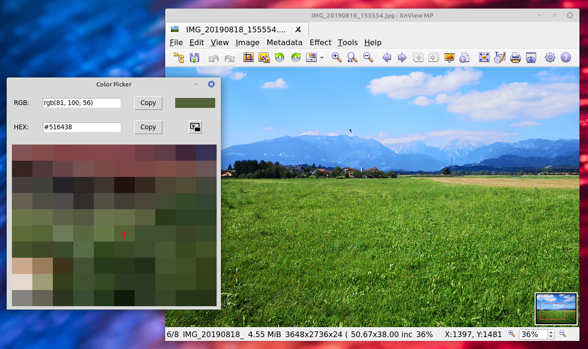

# Screen Color Picker



A screen color picker made in Python 3 using Tkinter, PIL, and pynput libraries.

Loosely based (general idea and the check_color function's image grab) on https://github.com/shreydan/global-color-picker

I wanted to make a very simple color picker with a GUI and to add a couple of useful features like having a zoom window, a crosshair for easier targeting, moving the cursor with the arrow keys, copying the colors directly to the clipboard, and minimizing the application to the tray.

## Requirements

- Python 3.x
- Tkinter
- PIL (Pillow)
- pynput
- pyautogui
- pystray

## Installation

1. Clone the repository:
    ```sh
    git clone https://github.com/csisztaiarnold/color_picker.git
    cd color_picker
    ```

2. Install the required libraries:
    ```sh
    pip install -r requirements.txt
    ```

3. Install tkinter (if not already installed):
    ```sh
    sudo apt-get install python3-tk
    ```

## Usage

Run the `color_picker.py` script:
```sh
python3 color_picker.py
```

- Move the mouse cursor to the desired color and press Space key to get the color.
- You could also move the cursor pixel by pixel with the arrow keys.
- Copy the color values to the clipboard by clicking the Copy buttons.
- Minimize the application to the tray by clicking the Minimize button.

## License

This project is licensed under the MIT License.